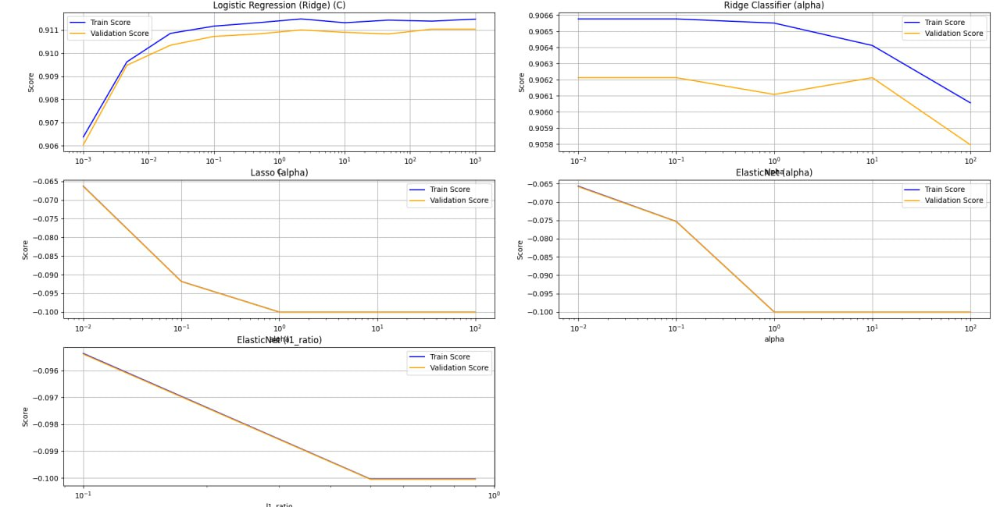

1. Data understanding
Розмір даних: (41188, 21)
Набір даних було завантажено та підготовлено:
Категоріальні змінні ('default', 'housing', 'loan', 'y') закодовані за допомогою LabelEncoder.
Інші категоріальні змінні закодовано за допомогою one-hot кодування.
Дані поділені на навчальний (70%) і тестовий (30%) набори.
Дані масштабовані за допомогою StandardScaler.
2. Побудова моделей
Для аналізу застосовано наступні лінійні моделі:

Логістична регресія з L2-регуляризацією (Ridge).
Ridge Classifier.
Lasso.
ElasticNet.
Найкращі параметри (гіперпараметри) моделей:
Logistic Regression (Ridge): C=215.44
Ridge Classifier: alpha=0.01
Lasso: alpha=0.01
ElasticNet: alpha=0.01, l1_ratio=0.1
3. Результати оцінки моделей
Логістична регресія (Ridge)
Тестові дані:
Точність (Accuracy): 0.91

Точність класифікації (Precision): 0.67

Повнота (Recall): 0.42

F1-метрика: 0.52

ROC AUC: 0.70

Confusion Matrix:

[[10682 286]
[ 800 589]]

Ridge Classifier
Тестові дані:
Точність (Accuracy): 0.91

Точність класифікації (Precision): 0.69

Повнота (Recall): 0.33

F1-метрика: 0.45

ROC AUC: 0.66

Confusion Matrix:

[[10756 212]
[ 927 462]]

Lasso
Тестові дані:
Середньоквадратична похибка (Mean Squared Error): 0.06
ElasticNet
Тестові дані:
Середньоквадратична похибка (Mean Squared Error): 0.06
4. Порівняння моделей
Валідаційні криві

Логістична регресія (Ridge):
Як видно на графіку, значення Validation Score стабільно зростає при збільшенні параметра C (зниження регуляризації) до 215.44, після чого стабілізується.
Різниця між Train Score та Validation Score мінімальна, що свідчить про добре збалансовану модель без перенавчання.
Це підтверджує ефективність оптимального значення C=215.44.

Ridge Classifier:
Графік демонструє, що збільшення alpha погіршує як Train Score, так і Validation Score.
Оптимальне значення alpha=0.01 дозволяє досягти найкращої якості моделі, але з великим ризиком недонавчання при збільшенні alpha.

Lasso:
Обидва показники (Train Score і Validation Score) мають значення середньоквадратичної похибки, які збільшуються при підвищенні alpha.
Мінімальна похибка досягається при alpha=0.01, але ефективність моделі є обмеженою.

ElasticNet:
Вплив параметрів alpha та l1_ratio показує схожі тенденції, як у Lasso.
Оптимальні значення параметрів забезпечують мінімальну середньоквадратичну похибку, але значення метрик свідчать про обмежену придатність ElasticNet для даної задачі.

Порівняння моделей
Класифікаційні моделі (Logistic Regression, Ridge Classifier):

Logistic Regression має кращу повноту (Recall: 0.42) та F1-метрику (0.52), що свідчить про кращу балансованість моделі.
Ridge Classifier демонструє дещо вищу точність (Precision: 0.69), але гірший результат за іншими метриками.
Регресійні моделі (Lasso, ElasticNet):

Обидві моделі мають однакову середньоквадратичну похибку (0.06), що свідчить про подібну ефективність.
5. Графік коефіцієнтів 

Top features sorted by importance:
                        Feature  Coefficient
8                  emp.var.rate    -2.832718
9                cons.price.idx     1.262242
4                      duration     1.196606
11                    euribor3m     0.704640
12                  nr.employed     0.355574
31            contact_telephone    -0.340715
32                    month_aug     0.274242
37                    month_may    -0.252273
36                    month_mar     0.225615
6                         pdays    -0.212020
35                    month_jun    -0.180504
45         poutcome_nonexistent     0.156175
38                    month_nov    -0.153864
1                       default    -0.102772
30  education_university.degree     0.102243
44              day_of_week_wed     0.081124
13              job_blue-collar    -0.077630
Найважливіші ознаки:

Найбільший вплив на модель має змінна emp.var.rate (рівень зайнятості), причому її коефіцієнт -2.832718 вказує, що вона має негативний вплив на ймовірність позитивного результату (цільової змінної).
Також значний позитивний вплив мають:
cons.price.idx (індекс споживчих цін) із коефіцієнтом 1.262242.
duration (тривалість дзвінка) із коефіцієнтом 1.196606. Це свідчить, що довші дзвінки підвищують ймовірність підписання депозиту. Але важливо зазначити, що для передбачення- це безсмыстовна річ, адже ми не знаємо і не можемо передбачити скільки часу буде тривати розмова між клієнтом і співробітником компанії. (візьмемо це до уваги в настпуних роботпх)
Інші важливі ознаки:

euribor3m (трьохмісячна ставка Euribor) із коефіцієнтом 0.704640 та nr.employed (кількість працюючих) із коефіцієнтом 0.355574 також мають значний позитивний вплив.
Контактний метод contact_telephone має негативний вплив (-0.340715), що може вказувати на менш успішні дзвінки через телефон у порівнянні з іншими каналами.
Місяці:

Підписання депозитів більш імовірне в таких місяцях:
month_aug (серпень, 0.274242).
month_mar (березень, 0.225615).
Менш імовірне підписання в травні (month_may, -0.252273) та червні (month_jun, -0.180504).
Інші категоріальні ознаки:

Освіта (education_university.degree) із коефіцієнтом 0.102243 позитивно корелює з підписанням.
Робота job_blue-collar має негативний вплив (-0.077630), що може вказувати на нижчу зацікавленість цієї категорії клієнтів у продукті.
Значення для бізнесу:

Кампанії варто фокусувати на клієнтах із довгими дзвінками, високим рівнем освіти, в місяці, такі як серпень і березень.
Негативний вплив змінних, таких як emp.var.rate і contact_telephone, може свідчити про необхідність перегляду маркетингової стратегії для цих груп.
Варто зазначити, що інші фактори, такі як дні тижня (наприклад, day_of_week_wed або day_of_week_thu і под.), мають невеликий або майже нульовий вплив на результуючу змінну. Це вказує на те, що день тижня не є ключовим фактором для прогнозування рішення клієнта.

6.1. Висновки (технічного характеру)
Найкраща модель: Логістична регресія (Ridge) завдяки кращим показникам F1-метрики (0.52) та ROC AUC (0.70), що робить її найбільш придатною для задачі класифікації.
Вплив гіперпараметрів: Регуляризація значно впливає на якість моделей. Зокрема, оптимальний параметр C для Logistic Regression та alpha для Ridge Classifier дозволяють досягти максимальних значень метрик.
6.2 Висновки
Показники, такі як ставка Euribor та рівень зайнятості, залишають помітний вплив на рішення клієнтів.
Регулярність взаємодії також відіграє важливу роль: тривалий час без контакту (pdays) суттєво знижує ймовірність підписання контракту.
Хоча успішні результати попередніх кампаній мають певний вплив на рішення клієнтів, його значення поступається іншим факторам.
Таким чином, для підвищення ефективності кампаній слід приділяти особливу увагу економічним умовам та частоті контактів з клієнтами.